# 🗺️ Ruta de Aprendizaje Visual

Este diagrama muestra la ruta completa de aprendizaje para convertirte en Data Engineer, desde los fundamentos hasta proyectos avanzados.

---

## 📊 Diagrama de la Ruta

```mermaid
graph TD
    A[🎯 Introducción] --> B[🛠️ Fundamentos]
    B --> C[💾 SQL]
    C --> D[🐍 Python]
    D --> E[🏗️ Modelado y Calidad]
    E --> F[⚙️ Pipelines]
    F --> G[☁️ Cloud]
    
    H[🤖 AI como Copiloto] -.Opcional.-> B
    H -.Opcional.-> C
    H -.Opcional.-> D
    
    I[🚀 Proyectos] --> J[Principiante]
    I --> K[Intermedio]
    I --> L[Avanzado]
    
    C --> I
    D --> I
    E --> I
    F --> I
    
    style A fill:#e1f5e1
    style B fill:#fff4e1
    style C fill:#ffe1e1
    style D fill:#e1e5ff
    style E fill:#f0e1ff
    style F fill:#ffe1f0
    style G fill:#e1f5ff
    style H fill:#fff0e1
    style I fill:#ffe1e1
```

---

## 📋 Flujo Recomendado

Sigue este orden para un aprendizaje progresivo:

1. **🎯 Introducción** → Entiende qué es Data Engineering
   - [¿Qué es Data Engineering?](que-es-data-engineering.md)
   - [Roles en Datos](roles-en-datos.md)
   - [Roadmap Data Engineer](roadmap-data-engineer.md)

2. **🛠️ Fundamentos** → Configura tu entorno y aprende conceptos base
   - Tipos de datos, pipelines, batch vs streaming
   - Git, Docker, archivos .env
   - [Módulo Fundamentos](../01_fundamentos/)

3. **💾 SQL** → La base de todo (empieza aquí si ya tienes fundamentos)
   - SQL básico, intermedio y avanzado
   - Modelado relacional
   - [Módulo SQL](../02_sql/)

4. **🐍 Python** → Programación para datos
   - Fundamentos Python
   - Pandas para manipulación
   - Jupyter Notebooks
   - [Módulo Python](../03_python/)

5. **🏗️ Modelado y Calidad** → Diseño y confiabilidad de datos
   - Modelado analítico (Star Schema)
   - Calidad de datos, validaciones
   - [Módulo Modelado y Calidad](../04_modelado_y_calidad/)

6. **⚙️ Pipelines** → Automatización y orquestación
   - Pipelines con Python
   - Orquestadores (Prefect, Dagster, Airflow)
   - [Módulo Pipelines](../05_pipelines/)

7. **☁️ Cloud** → Escalabilidad y servicios gestionados
   - AWS, GCP, Azure
   - Servicios principales
   - [Orquestadores Cloud](../05_pipelines/orquestadores/cloud/)

8. **🚀 Proyectos** → Aplica todo lo aprendido (puedes empezar en cualquier momento)
   - Principiante: Pipeline ETL simple
   - Intermedio: Validaciones, Airflow local
   - Avanzado: Producción, cloud, pipelines completos
   - [Módulo Proyectos](../07_proyectos/)

---

## 💡 Tips Importantes

### 🤖 AI como Copiloto (Opcional)

El módulo de **Inteligencia Artificial como Copiloto** puede usarse en cualquier momento:
- Puede ayudarte durante Fundamentos, SQL o Python
- Es completamente opcional
- [Módulo AI](../06_inteligencia_artificial/)

### 🚀 Proyectos

Los proyectos están conectados a múltiples módulos:
- Puedes empezar proyectos después de SQL
- Puedes continuar agregando complejidad después de Python
- Puedes aplicar validaciones después de Modelado y Calidad
- Puedes orquestar después de Pipelines

### ⚡ Flexibilidad

> 💡 **Tip**: Puedes saltar etapas si ya tienes experiencia, pero te recomendamos revisar los fundamentos primero.

Si ya tienes experiencia en:
- **SQL**: Puedes empezar directamente en SQL y luego Python
- **Python**: Puedes empezar en Python y luego Modelado y Calidad
- **Ambos**: Puedes ir directamente a Modelado, Calidad y Pipelines

---

## 🧭 Navegación Rápida

- **¿Eres principiante?** → Empieza por [Introducción](que-es-data-engineering.md)
- **¿Ya sabes SQL/Python?** → Salta a [Modelado y Calidad](../04_modelado_y_calidad/)
- **¿Quieres ver la ruta completa?** → Revisa el [Roadmap](roadmap-data-engineer.md)
- **¿Quieres empezar haciendo?** → Ve a [Proyectos Principiante](../07_proyectos/principiante/)

---

## ➡️ ¿Qué sigue?

Una vez que entiendas la ruta:

1. **Lee** [¿Qué es Data Engineering?](que-es-data-engineering.md)
2. **Revisa** el [Roadmap completo](roadmap-data-engineer.md)
3. **Configura** tu entorno siguiendo [SETUP.md](../../SETUP.md)
4. **Sigue** el orden sugerido en el diagrama

---

> **Recuerda**: La ruta es una guía, no una regla. Adapta tu aprendizaje según tus necesidades y experiencia previa.
